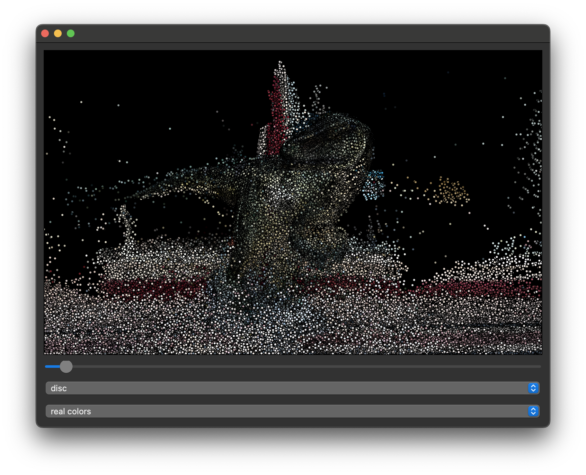

# PointCloudViewer

## Overview

PointCloudViewer is a PyQt5 and Vispy-based application that allows users to visualize 3D point cloud data. With a user-friendly GUI, the application supports features such as adjusting point size, changing point shapes, and applying color gradients based on depth.

## How to Use the Project

1. **Launch**: Execute the script. A file dialog will prompt you to select a point cloud file (currently supported formats: .ply and .pts).
2. **Adjust Point Size**: Use the horizontal slider to increase or decrease the point sizes in the visualization.
3. **Change Point Shape**: From the dropdown menu, select the desired point shape (options include 'disc', 'arrow', 'ring', etc.).
4. **Color Gradient**: The gradient dropdown allows you to switch between real colors (as given in the data) and a depth-based gradient where near points are colored white and far points black.

## Project Structure & Goals

- **load_point_cloud**: Loads point cloud data from PLY files.
- **load_pts**: Reads PTS files and returns points and their colors.
- **compute_depths**: Computes depths of each point from a given camera position.
- **apply_gradient**: Applies a color gradient based on the depths.
- **PointCloudViewer (class)**: The main GUI application handling user interactions and visualization.

The primary goal of this project is to provide an interactive, easy-to-use platform to visualize 3D point cloud data. Users can get insights into their 3D data while also having flexibility in visual representation through adjustable point sizes, shapes, and color schemes.

## Exploring the Dataset

### Weaknesses of Visualization:

Limited File Format Support: Currently, it only supports PLY and PTS formats.
Fixed Gradient Colors: The gradient based on depth is limited to black and white.
Performance: For large datasets, performance can be an issue as the entire visualization updates upon any change.

### Challenges Faced:

- **Diverse Data**: Different datasets may have variations, making it challenging to have a one-size-fits-all visualization.
- **UI Integration**: Integrating the visualization seamlessly into the PyQt5 GUI required handling various events and updates.

### Possible Improvements:

- **Support More File Formats**: Extend support to other popular point cloud formats.
- **Customizable Gradient**: Allow users to choose gradient start and end colors.
- **Optimize for Large Datasets**: Implement level-of-detail or data decimation techniques to improve performance.
- **Additional Features**: Integrate features like point selection, point cloud transformations, and data statistics.
